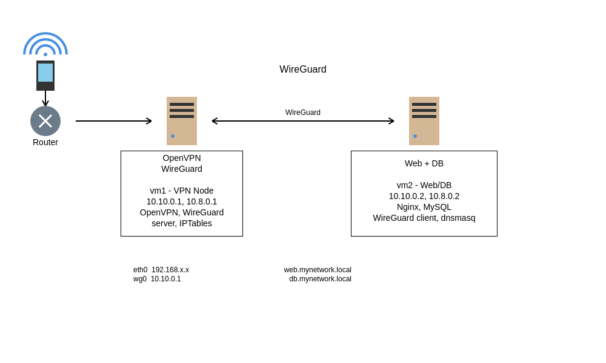

# 🛡️ Secure VPN Infrastructure Project

This project demonstrates a secure and isolated network infrastructure using:

- 🔐 **OpenVPN** and **WireGuard** for secure remote access (VM1)
- 🌐 **Nginx** and **MySQL** for web and database services (VM2)
- 📡 **dnsmasq** for internal DNS resolution (VM2)
- 🔥 Strict **IPTables** firewall rules (exported as `rules.v4`)
- 🛠️ Configured for client access only through VPN and tunnels
- 📜 Automated setup scripts for both VMs

---

## Architecture

## 🧩 Components

| Hostname | Type     | IP Address(es)      | Description                                                     |
|----------|----------|---------------------|-----------------------------------------------------------------|
| `vm1`    | VPN Node | `10.10.0.1`, `10.8.0.1`            | Runs OpenVPN, WireGuard server, and IPTables     |
| `vm2`    | Web/DB   | `10.10.0.2`, `10.8.0.2`            | Runs Nginx, MySQL, WireGuard client, dnsmasq     |

---

## 🚀 Key Features

- **Zero Trust**: No public services — VPN is required to access internal resources.
- **Layered VPN**: OpenVPN for remote clients, WireGuard tunnel between VMs.
- **Custom DNS**: Internal DNS with `dnsmasq` over VPN only.
- **Firewall Hardened**: Strict `iptables` rules with exports included for VM1 and VM2.
- **Automated Setup**: Scripts to fully install and configure both VMs.

---

## 🧪 Technologies Used

- Ubuntu Server 24.04
- OpenVPN
- WireGuard
- IPTables (`rules.v4`)
- dnsmasq
- Nginx
- MySQL

---

## 📝 License

This project is licensed under the MIT License.
